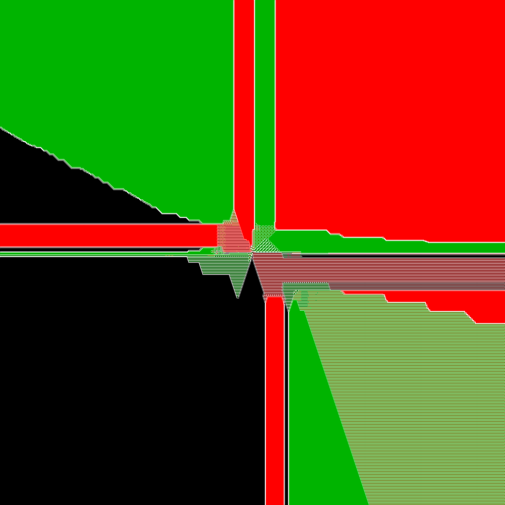
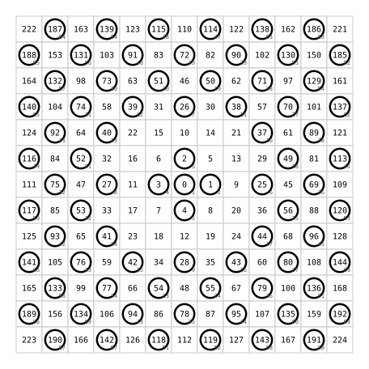
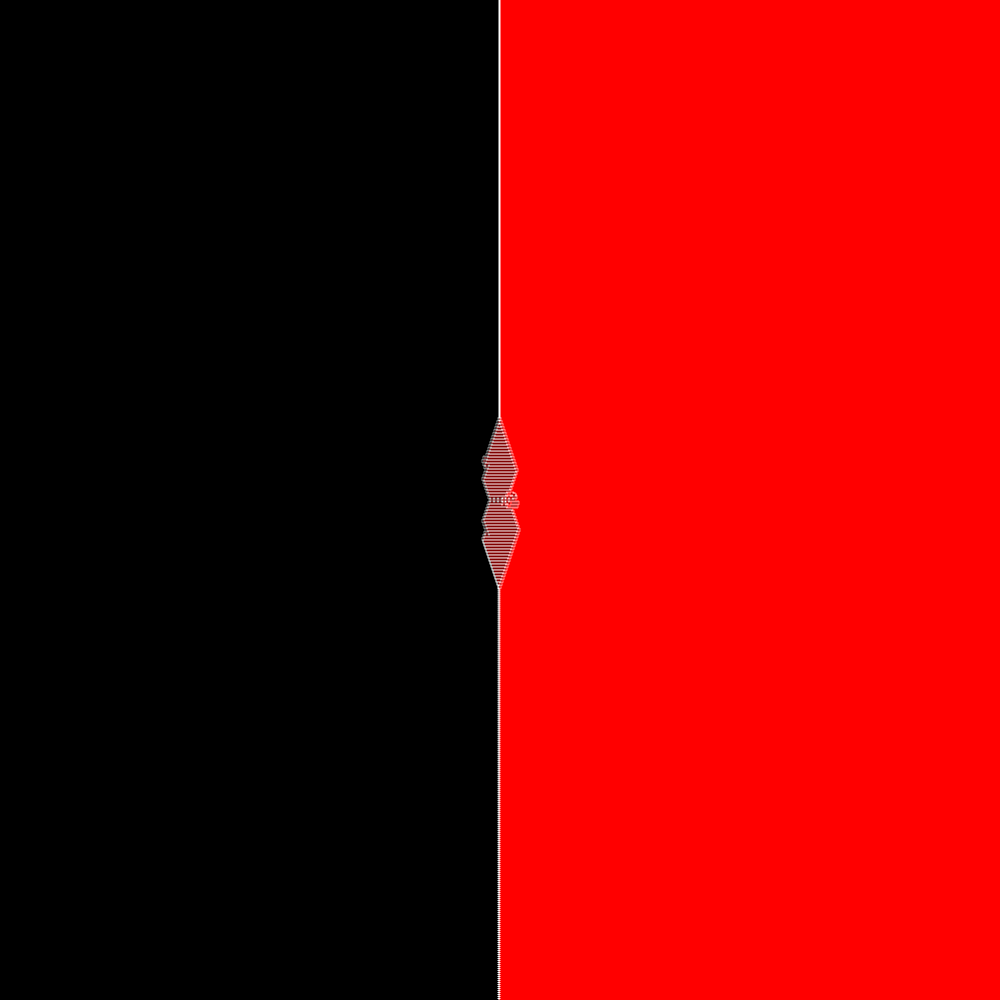
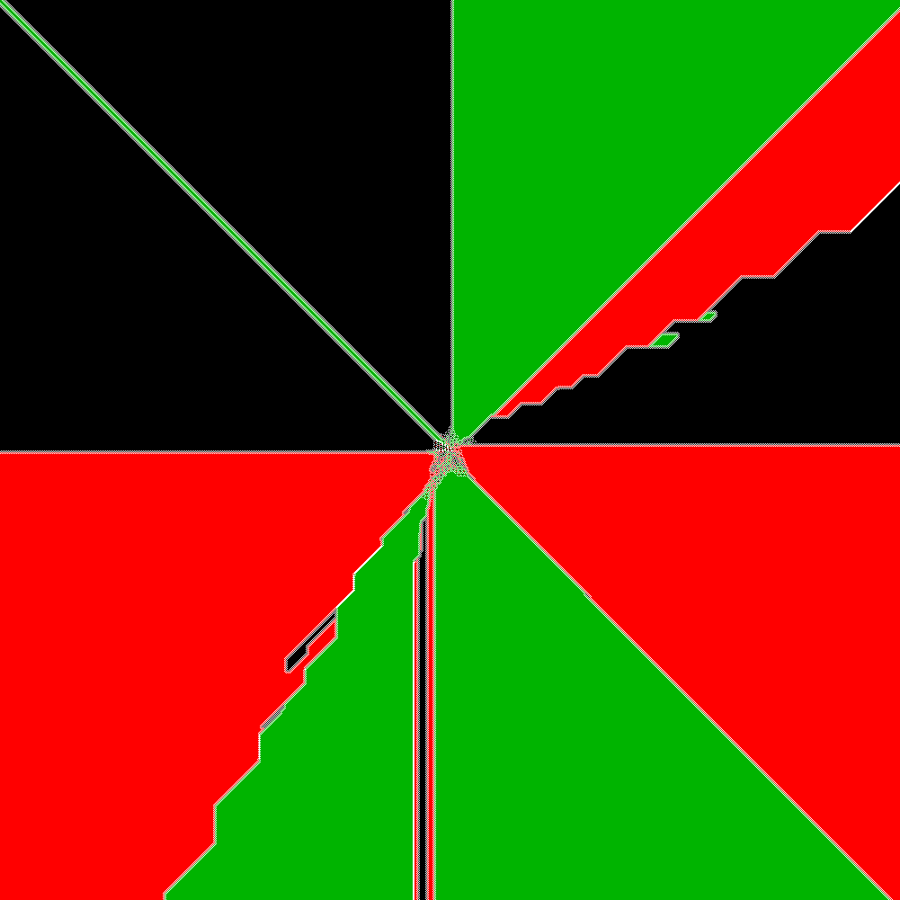
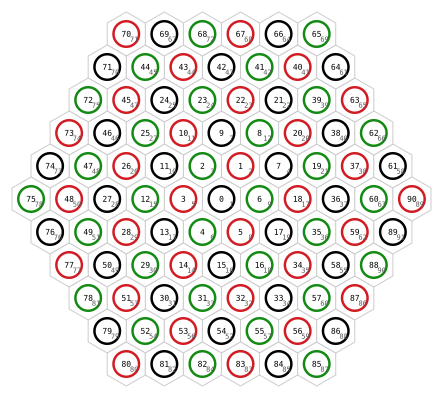
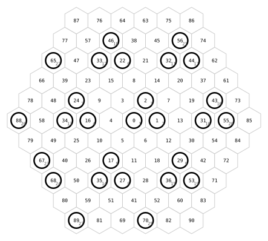

# Knight Quadrants

Artifact index: `03`

This artifact starts from the OEIS red/black knight-cover picture and then varies
the scan order, the number of colors, and the underlying geometry. The goal is to
separate large-scale visual structure from artifacts of the ordering rule.

The current color families are:

- `b`
- `br`
- `brg`
- `brgy`

The current scan orders are:

- `spiral`
- `dist-atan`

The current geometries are:

- `square`
- `hex`

For `hex`, the `dist-atan` order uses the Euclidean basis transform of axial
coordinates before distance and angle are computed. For `hex`, the `spiral`
order is built ring-by-ring; each consecutive site touches a nearest-neighbor
site from the previous step, and each new ring is entered by a nearest-neighbor
transition.

## Examples

The curated sample renders live in `examples/`. They are meant to make the README
browseable online without requiring a full local image build. The debug images
focus on local correctness: site order, grid geometry, and the first places where
the attack rule constrains a move. The larger images are for broader visual
features: sectors, waves, fronts, and the way those structures change with order,
color count, and grid type.

### Square lattice

#### Spiral order

<div align="center">
  <figure>
    <br>
    <figcaption><strong>Square spiral, three colors.</strong> This large image shows the square spiral scan with the `b`, `r`, `g` color cycle. It is useful for broad comparison: the square grid keeps strong axis directions, while the third color breaks the simpler two-color symmetry.</figcaption>
  </figure>
</div>

#### Dist-atan order

<div align="center">
  <figure>
    <br>
    <figcaption><strong>Square dist-atan debug, one color.</strong> This small window checks the radius-angle order on the square grid. The one-color rule is self-attacking, so the checkerboard-like local constraint is intentional.</figcaption>
  </figure>
</div>

<div align="center">
  <figure>
    <br>
    <figcaption><strong>Square dist-atan, two colors.</strong> This is the square red-black radius-angle case. It removes the literal spiral path, so broad sectors and fronts here are better candidates for structures caused by color blocking rather than by spiral traversal.</figcaption>
  </figure>
</div>

<div align="center">
  <figure>
    <br>
    <figcaption><strong>Square dist-atan, three colors.</strong> Adding green changes the color cycle while preserving the same square radius-angle order. This image is useful for checking which large-scale red-black features survive after the color symmetry is broken.</figcaption>
  </figure>
</div>

### Hex lattice

#### Spiral order

<div align="center">
  <figure>
    <br>
    <figcaption><strong>Hex spiral debug, three colors.</strong> This debug image checks the basic hex geometry: numbered cells should layer around the center by nearest-neighbor steps, and the colors should cycle through `b`, `r`, `g` on that hex spiral.</figcaption>
  </figure>
</div>

<div align="center">
  <figure>
    <br>
    <figcaption><strong>Hex spiral, four colors.</strong> This large hex spiral is the main comparison against square spiral images. The six-direction grid and short hex-knight rule tend to smooth or redirect fronts that are more axis-bound on the square lattice.</figcaption>
  </figure>
</div>

#### Dist-atan order

<div align="center">
  <figure>
    <br>
    <figcaption><strong>Hex dist-atan debug, one color.</strong> This small window checks that axial coordinates are basis-transformed before distance and angle are computed. With one color, self-attack gives a local test of the short hex-knight exclusion rule.</figcaption>
  </figure>
</div>

<div align="center">
  <figure>
    <br>
    <figcaption><strong>Hex dist-atan, two colors.</strong> This large red-black hex image removes adjacent spiral traversal while keeping an outward radius-angle scan. It is the cleanest comparison for separating hex geometry from the square-grid effect.</figcaption>
  </figure>
</div>

## Rule

On a color's turn, scan forward from that color's previous cursor and cover the
first site which is:

1. not already covered by any color;
2. not attacked by a knight of another color.

Exception: in the one-color case (`colors = b`), the single color attacks itself.
This is the intended constraint for the one-color board.

Each site is covered at most once.

## Hex short-knight convention

The hexagonal attack rule uses the six-position short-knight move:

```text
move forward one hex edge, turn 60 degrees counterclockwise,
then move forward one more hex edge
```

This replaces the older twelve-position `2 + turn` hex-knight rule.

## Layout

```text
03-knight-quadrants/
  README.md
  Makefile
  examples/
  src/
    knight_quadrant.py
    legacy/
  data/
    spiral/
      square/
      hex/
    dist-atan/
      square/
      hex/
  img/
    spiral/
      square/
        *.png
        debug/*.svg
      hex/
        *.svg
        debug/*.svg
    dist-atan/
      square/
        *.png
        debug/*.svg
      hex/
        *.svg
        debug/*.svg
```

Geometry files are primary cached data. They store the ordered lattice sites and
index map for one `(geometry, order, radius)` choice. They are generated once
and then reused across all color sets.

## Main commands

```bash
make smoke
make debug
make images
make all
```

`make debug` generates small debug SVGs for every case. `make images` generates
the larger final images. `make all` runs smoke checks, then debug generation,
then final image generation.

Smoke also runs:

```bash
python3 src/knight_quadrant.py check-hex-knight
python3 src/knight_quadrant.py check-hex-spiral
```

## Defaults

The current default image radii are intentionally large:

```text
square image radius = 500
hex image radius    = 120
```

This means the default square PNG windows are about `1001 x 1001` cells. Radii
can be overridden from `make` when smaller or larger runs are useful.
