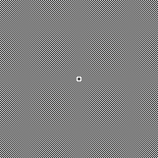
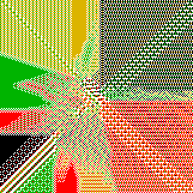
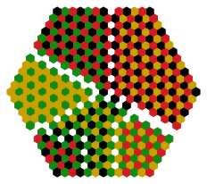
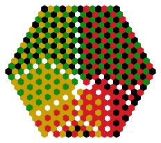

# Knight Quadrants

Artifact index: `03`

This artifact starts from the OEIS red/black knight-cover picture and then varies
the scan order, the number of colors, and the underlying geometry. The goal is to
separate large-scale visual structure from artifacts of the ordering rule.

The current color families are:

- `b`
- `br`
- `brg`
- `brgy`

The current scan orders are:

- `spiral`
- `dist-atan`

The current geometries are:

- `square`
- `hex`

For `hex`, the `dist-atan` order uses the Euclidean basis transform of axial
coordinates before distance and angle are computed. For `hex`, the `spiral`
order is built ring-by-ring; each consecutive site touches a nearest-neighbor
site from the previous step, and each new ring is entered by a nearest-neighbor
transition.

## Examples

These are small sample renders stored in `example/`. They are meant to make the
README browseable online without requiring a full local image build.

<div align="center">
  <figure>
    
    <figcaption>Square lattice, `dist-atan`, one color. The one-color rule is self-attacking, so the checkerboard-like constraint is intentional.</figcaption>
  </figure>
</div>

<div align="center">
  <figure>
    
    <figcaption>Square lattice, `spiral`, four colors.</figcaption>
  </figure>
</div>

<div align="center">
  <figure>
    
    <figcaption>Hex lattice, `spiral`, four colors. The hex spiral is generated by adjacent steps around the center.</figcaption>
  </figure>
</div>

<div align="center">
  <figure>
    
    <figcaption>Hex lattice, `dist-atan`, four colors. Axial coordinates are basis-transformed before radial ordering.</figcaption>
  </figure>
</div>

## Rule

On a color's turn, scan forward from that color's previous cursor and cover the
first site which is:

1. not already covered by any color;
2. not attacked by a knight of another color.

Exception: in the one-color case (`colors = b`), the single color attacks itself.
This is the intended constraint for the one-color board.

Each site is covered at most once.

## Hex short-knight convention

The hexagonal attack rule uses the six-position short-knight move:

```text
move forward one hex edge, turn 60 degrees counterclockwise,
then move forward one more hex edge
```

This replaces the older twelve-position `2 + turn` hex-knight rule.

## Layout

```text
03-knight-quadrants/
  README.md
  Makefile
  example/
  src/
    knight_quadrant.py
    legacy/
  data/
    spiral/
      square/
      hex/
    dist-atan/
      square/
      hex/
  img/
    spiral/
      square/
        *.png
        debug/*.svg
      hex/
        *.svg
        debug/*.svg
    dist-atan/
      square/
        *.png
        debug/*.svg
      hex/
        *.svg
        debug/*.svg
```

Geometry files are primary cached data. They store the ordered lattice sites and
index map for one `(geometry, order, radius)` choice. They are generated once
and then reused across all color sets.

## Main commands

```bash
make smoke
make debug
make images
make all
```

`make debug` generates small debug SVGs for every case. `make images` generates
the larger final images. `make all` runs smoke checks, then debug generation,
then final image generation.

Smoke also runs:

```bash
python3 src/knight_quadrant.py check-hex-knight
python3 src/knight_quadrant.py check-hex-spiral
```

## Defaults

The current default image radii are intentionally large:

```text
square image radius = 500
hex image radius    = 120
```

This means the default square PNG windows are about `1001 x 1001` cells. Radii
can be overridden from `make` when smaller or larger runs are useful.
