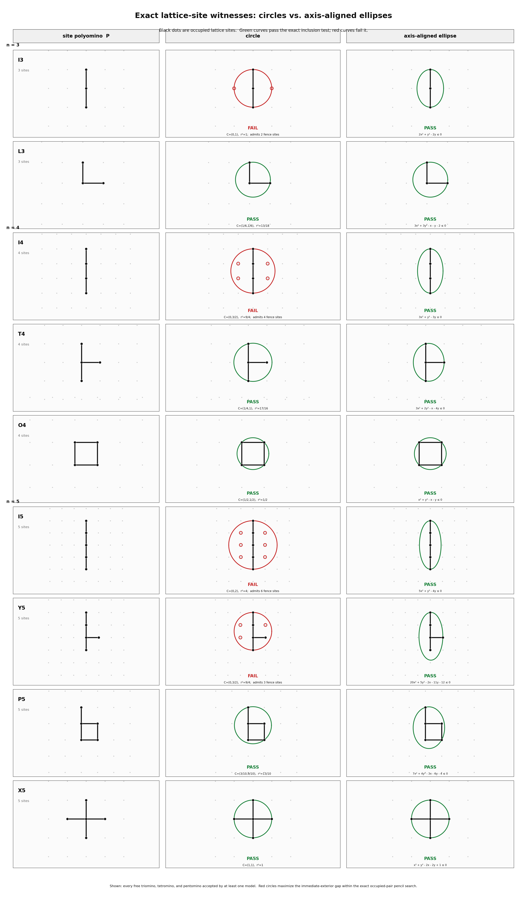

# Axis-aligned ellipse polyominoes

This project counts free square-lattice polyominoes that occur as **all** lattice sites inside a translated, axis-aligned Euclidean ellipse.  It is an experimental exact-enumeration baseline.

A polyomino here is a finite, 4-connected set `P` of occupied lattice sites.  The usual unit-square picture is only a drawing convention.  The actual question is whether there is an ellipse whose intersection with the integer lattice is exactly `P`.

## Model

The recognizer uses the implicit equation

$$
Q(x,y)=A x^2+B y^2+C x+D y+E \le 0,
\qquad A>0,\quad B>0.
$$

This is a translated axis-aligned ellipse whenever its sublevel set is nonempty.  Multiplying all coefficients by a positive scalar leaves the ellipse unchanged, so the program fixes the scale with

$$
A+B=1.
$$

A candidate is accepted when the exact solver finds coefficients with a positive separation margin `epsilon` such that:

- every occupied hull vertex has `Q(x,y) <= 0`;
- every immediate unoccupied 4-neighbor has `Q(x,y) >= epsilon`;
- `A >= epsilon` and `B >= epsilon`.

The hull condition is sufficient on the occupied side because an ellipse is convex.  The exterior fence is sufficient on the excluded side because the lattice sites of an axis-aligned ellipse are 4-connected: every occupied row contains a nearest lattice site to the ellipse center, and the nonempty rows form an interval.

All acceptance decisions are made by an exact two-phase simplex over `boost::multiprecision::cpp_rational`.  There is no floating-point comparison in the ellipse predicate.

## Counts obtained so far

### Exhaustive baseline: orders 1 through 14

The program enumerated all free polyominoes at each order, reduced them by the eight symmetries of the square lattice, and applied the exact ellipse predicate.  The resulting counts are:

| order `n` | 1 | 2 | 3 | 4 | 5 | 6 | 7 | 8 | 9 | 10 | 11 | 12 | 13 | 14 |
|---:|---:|---:|---:|---:|---:|---:|---:|---:|---:|---:|---:|---:|---:|---:|
| ellipse polyominoes | 1 | 1 | 2 | 3 | 4 | 6 | 7 | 10 | 13 | 17 | 20 | 24 | 30 | 36 |

The machine-readable record is [`results/exhaustive_n1_n14.csv`](results/exhaustive_n1_n14.csv).  At `n = 14`, the direct run considered 901,971 free polyominoes, retained 2,777 lattice-convex candidates, accepted 36 ellipses, and took about 3.6 seconds on the recorded runner.

### Hereditary continuation: orders 15 through 20

The continuation starts from the exhaustive accepted order-14 set.  At each later order it adds one lattice site to every accepted predecessor, deduplicates under square-lattice symmetry, and classifies the resulting candidates exactly.

| order `n` | 15 | 16 | 17 | 18 | 19 | 20 |
|---:|---:|---:|---:|---:|---:|---:|
| accepted successor candidates | 42 | 47 | 55 | 65 | 72 | 80 |

These values are stored in [`results/successor_depth1_n15_n20.csv`](results/successor_depth1_n15_n20.csv).  They are **not claimed to be exhaustive ellipse counts**.  A realizable order-`n` ellipse polyomino could, in principle, have no realizable one-site-deleted predecessor.  The proposed depth-2 recovery run was not retained as a validation check because the current exact simplex has an unresolved pathological slowdown in that mode at order 20.

## What has been checked

The package separates three levels of evidence.

1. **Exact predicate.** The C++ recognizer solves its coefficient feasibility problem in rational arithmetic.  A returned witness is an exact rational conic plus a positive rational separation margin; no sampled curve or numeric tolerance decides acceptance.

2. **Direct exhaustive enumeration through 14.** The count table through `n = 14` comes from all free polyominoes, not from accepted predecessors.  Fresh command output and CSV are included in [`results/exhaustive_n1_n14.txt`](results/exhaustive_n1_n14.txt) and [`results/exhaustive_n1_n14.csv`](results/exhaustive_n1_n14.csv).

3. **Independent floating-point cross-check through 10.** [`tools/crosscheck_n10_scipy.py`](tools/crosscheck_n10_scipy.py) regenerates all free polyominoes through `n = 10`, reads the exact C++ witness list, and independently classifies the same canonical shapes using SciPy/HiGHS.  It agreed shape-for-shape with the exact C++ output: 64 accepted shapes across orders 1 through 10.  The run log is [`validation/scipy_shape_check_n10.txt`](validation/scipy_shape_check_n10.txt).  This is a useful independent implementation check, but it is not the deciding arithmetic and it does not prove the continuation beyond 14.

## Small-order comparison gallery

The following code-drawn figure is a comparison aid, not the definition of this count.  It shows every triomino, tetromino, and pentomino accepted by at least one of the circle or axis-aligned-ellipse models.  Green ellipses are exact rational witnesses.  Red circles are exact-predicate failures, with the immediate exterior sites they wrongly include marked in red.



The scalable figure is [`results/circle_vs_axis_ellipse_tri_tet_pent.svg`](results/circle_vs_axis_ellipse_tri_tet_pent.svg), and the curve equations and certificates are in [`results/circle_vs_axis_ellipse_tri_tet_pent_certificates.md`](results/circle_vs_axis_ellipse_tri_tet_pent_certificates.md).

## Build and reproduce

```sh
make

# Fresh exhaustive baseline through order 14.
./ellipse_polyomino --max-n 14 --csv results/exhaustive_n1_n14.csv

# One-square hereditary continuation through order 20.
./ellipse_polyomino --max-n 20 --exhaustive-through 14 --depth 1 \
  --csv results/successor_depth1_n15_n20.csv

# Optional independent SciPy/HiGHS cross-check through order 10.
python3 tools/crosscheck_n10_scipy.py ./ellipse_polyomino
```

The C++ program requires a C++20 compiler and Boost.Multiprecision headers.  The optional independent checker additionally requires Python, NumPy, and SciPy.

## Next technical question

The present recognizer searches the full axis-aligned ellipse family by exact linear feasibility.  A separate finite-event approach remains open: choose contact sites, solve the corresponding contact conic, order the finite candidates by semiaxis product, and test the adjacent sign chamber.  Establishing a complete predecessor or contact theorem would be needed before extending the post-14 values as certified full counts.
